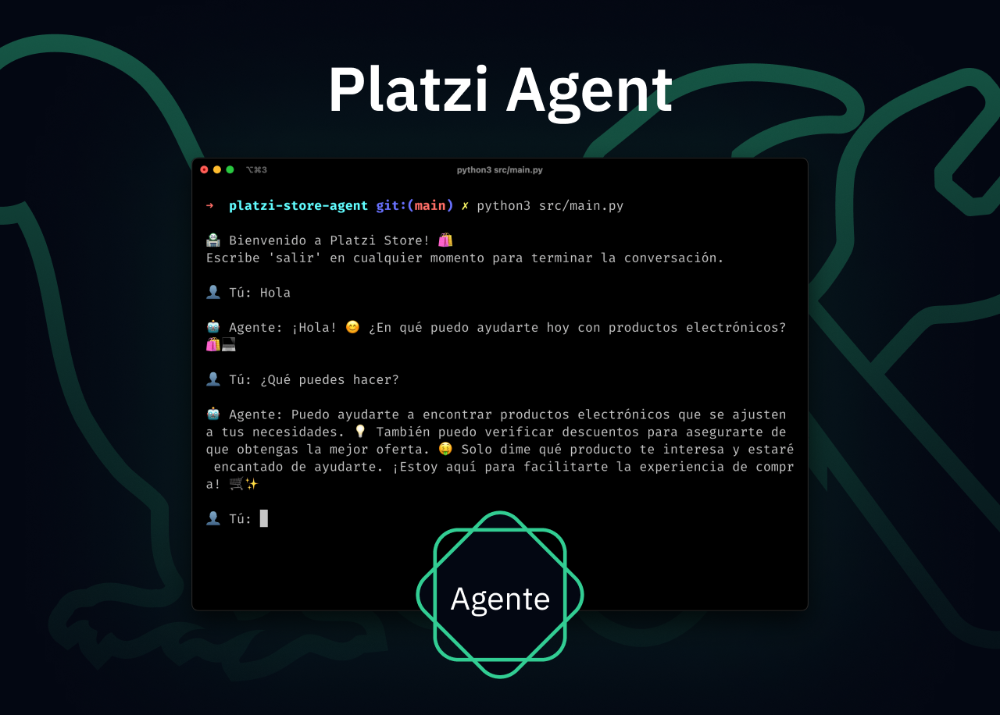
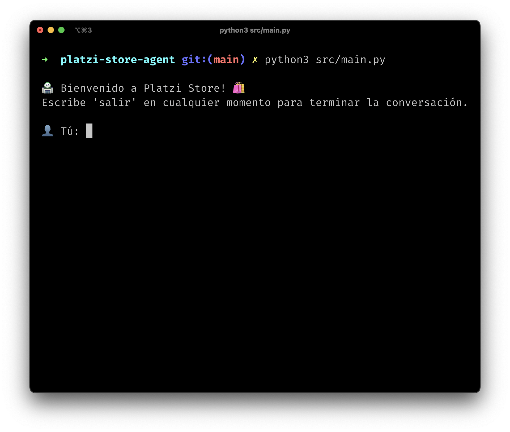
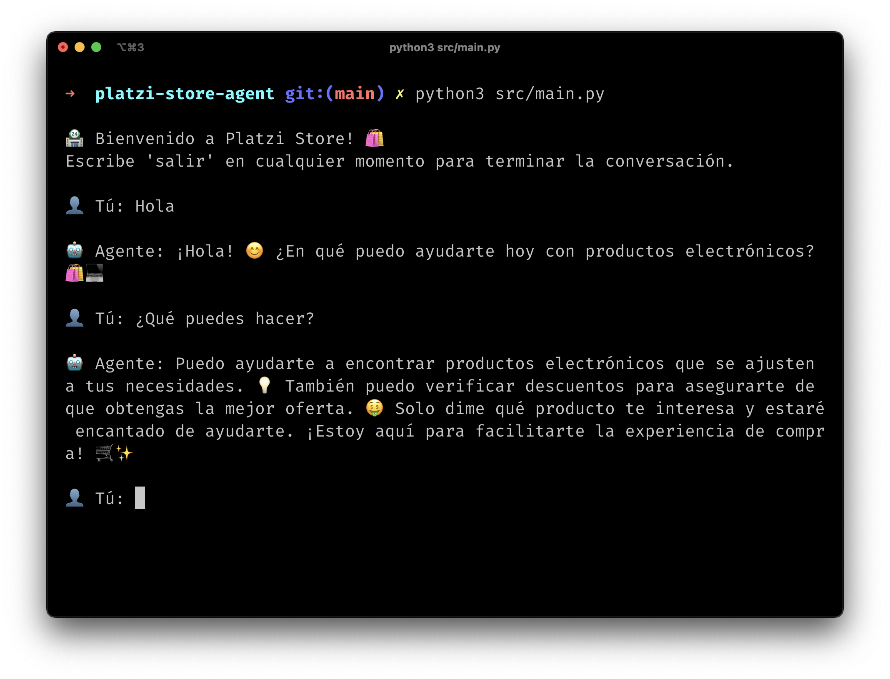

<h1 align="center">💡 Platzi Store Agent 💻</h1>

<p align="center">
  Platzi Store Agent es un agente para una tienda de electrónicos, que mejoraremos con técnicas de observabilidad.
</p>



👋 ¡Hola! Este repositorio contiene el proyecto final del curso de Observabilidad de Aplicaciones. Puedes empezar [instalando el proyecto](#instalación) y luego [revisar los commits por clase](#commits-por-clase).

## 🚀 Instalación

1. Clona el repositorio

```bash
git clone https://github.com/platzi/platzi-store-agent.git
```

2. Instala las dependencias del servidor

Empieza desde la carpeta `platzi-store-agent`

```bash
cd platzi-store-agent
python -m venv env
source env/bin/activate
```

3. Inicia el agente

Empieza desde la carpeta `platzi-store-agent`

```bash
python src/app.py
```

¡Listo! Ahora deberías ver el agente corriendo en tu terminal:





## 🎄 Commits por clase

Puedes copiar el comando de cada commit y pegarlo en tu terminal para revisar el código avanzado de cada clase.

| Clase                                            | Commit                 | Cambios                                        |
| ------------------------------------------------ | ---------------------- | ---------------------------------------------- |
| Observabilidad en agentes de IA                  | `git checkout 4360542` | Configuración de LangSmith.                    |
| Principios de trazabilidad en IA                 | `git checkout 064716d` | Platzi Store Agent con Trazabilidad.           |
| Principios de trazabilidad en IA                 | `git checkout 2ed9757` | Trazabilidad con RunTree.                      |
| Técnicas avanzadas de trazabilidad de IA         | `git checkout 46f5e71` | Implementación de trazabilidad.                |
| ¿Cómo agregar respuestas esperadas en LangSmith? | `git checkout acd8e29` | Generación del dataset.                        |
| ¿Cómo evaluar un agente de IA?                   | `git checkout 8618524` | Evaluación del agente.                         |
| Trayectoria de comportamiento de un agente IA    | `git checkout 78f229a` | Evaluación de la trayectoria del agente.       |
| Automatización de Anotaciones y Reglas           | `git checkout 4955efa` | Ajuste de la función de búsqueda de productos. |
